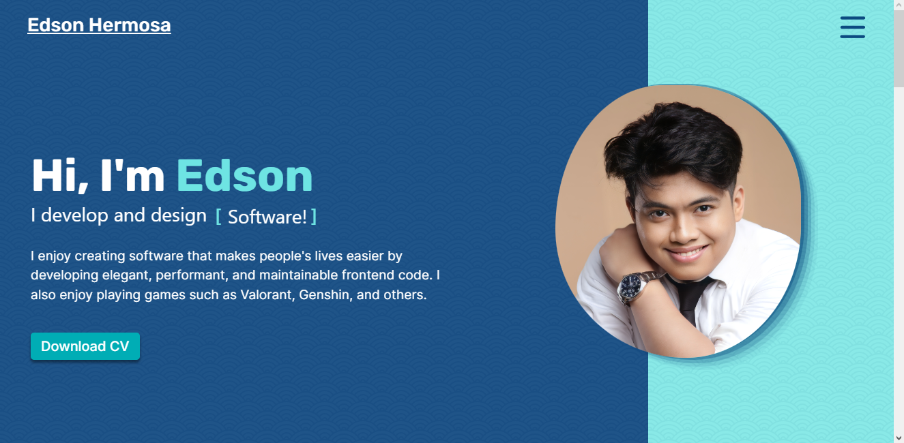
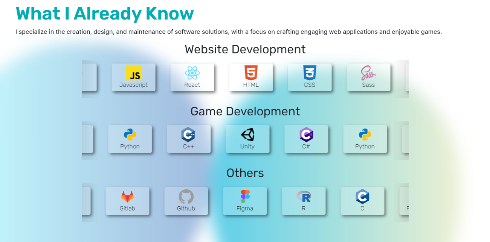
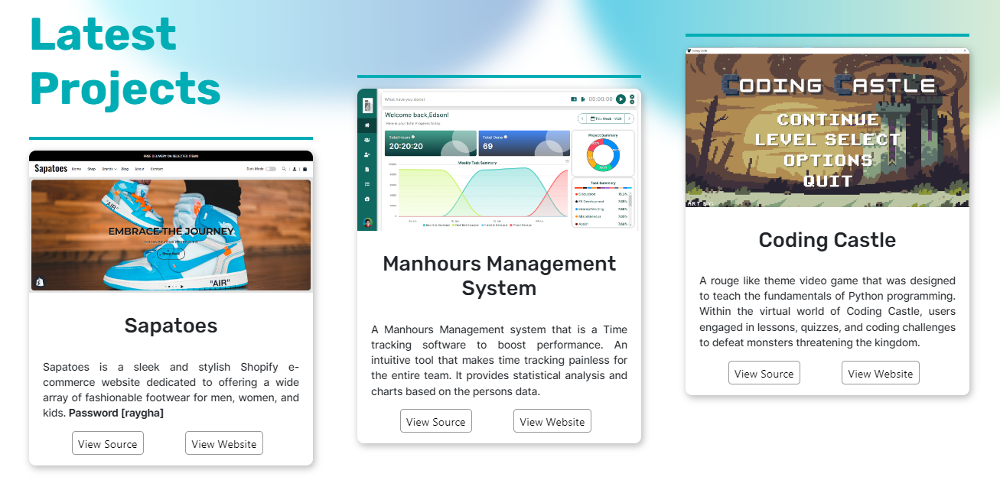
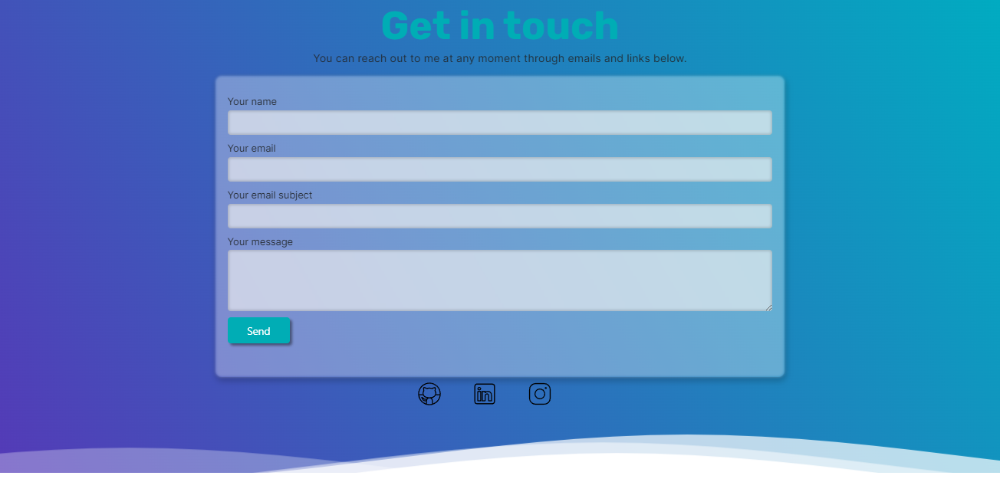

<h1>Edson Hermosa - Portfolio Website</h1>
 

URL
<a href="https://etherms.github.io/Portfolio/">https://etherms.github.io/Portfolio/</a>

A Portfolio website that shows what I have accomplished so far

<h2>Built With</h2>
<ul>
    <li><a href="http://vanilla-js.com">Vanilla Javascript</a></li>
    <li><a href="https://sass-lang.com">Sass</a></li>
    <li><a href="https://getbootstrap.com">Bootstrap</a></li>
    <li>NPM / Node.js</li>
</ul>

